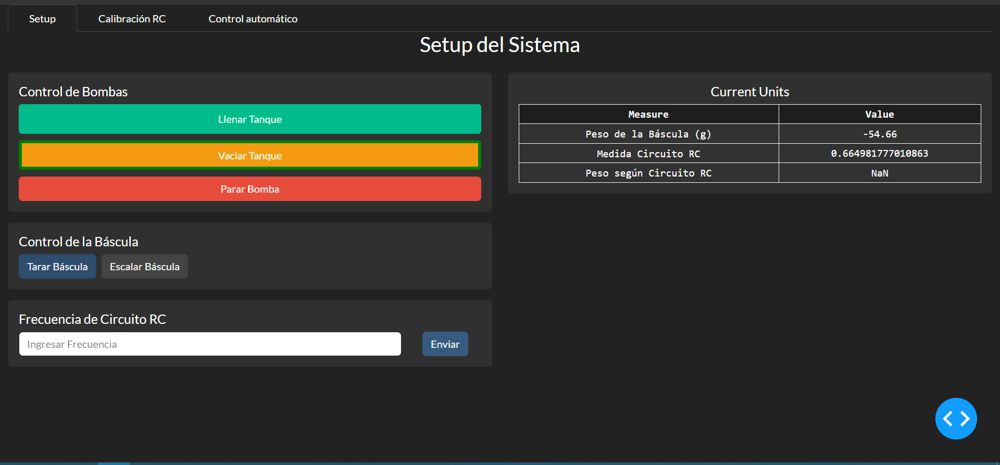
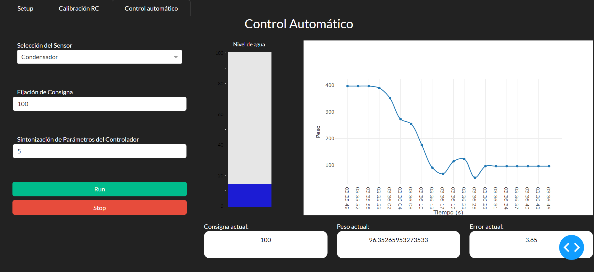

# Water Level Instruments

## Introduction

This repository contains the code for water level measurement instruments. We have two different instruments:

1. **Scale**: Controlled using an Arduino Nano, employing an On-Off control method.
2. **Red Pitaya Instrument**: Features an SCPI server and is controlled via SCPI using Python within the same local network.

### Graphical Interface

The graphical interface is developed in Python using Dash. It includes:

- **Setup Section**: For configuring measurement parameters.
- **Calibration Section**: Dedicated to the RC circuit calibration.
- **Water Level Control Section**: Offers the option to control the water level using either the capacitor or the scale.

Setup Section       

Control Section
