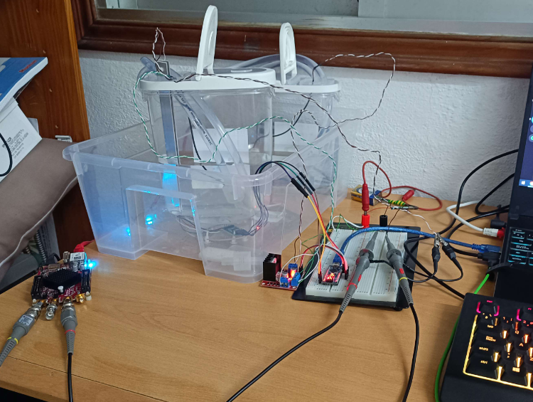
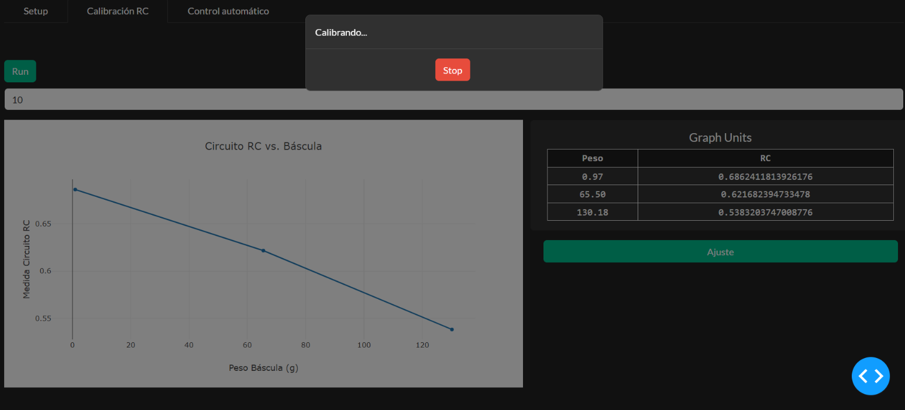
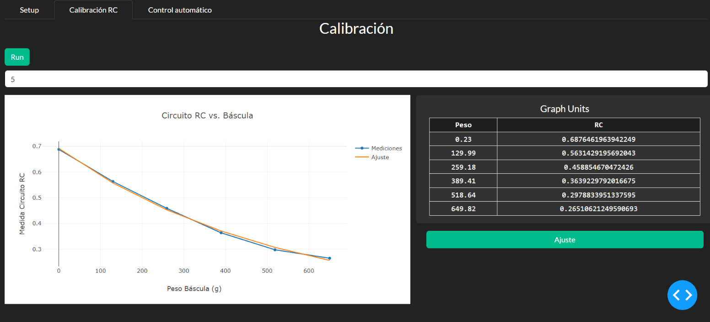

# Water Level Instruments

This project explores the realm of virtual instrument programming, focusing on water level measurement using two main instruments: the **Arduino Nano** and the **Red Pitaya**. Both are integrated into a complex system that enables precise and automated water level measurement and control, using advanced control and communication technologies.

### Virtual Instruments

**1. Arduino Nano as a Virtual Instrument**

The Arduino Nano acts as the core of a virtual instrument that controls a scale and motors via a serial connection. Using an On-Off control method, the Arduino receives setpoint instructions from a Python script. This interaction allows the Arduino to directly manipulate the system's mechanics (such as adjusting the water level using motors) based on the data received and processed by Python. The control loop residing in the Arduino enables immediate and accurate responses to commands, essential for maintaining the desired water level.

**2. Red Pitaya as a Virtual Instrument**

On the other hand, the Red Pitaya introduces an advanced level of control and measurement. Operating with an SCPI server, it allows communication and control via SCPI commands within the same local network. The Red Pitaya measures the values of an RC circuit which, once calibrated, can determine the water level by the weight's equivalence. In this case, the control loop shifts to Python, where the measured values are processed, and direct commands are sent to the Arduino to adjust the system as needed. This hybrid approach leverages the precision of electronic measurement and the flexibility of software control.

### Graphical Interface in Dash

To interact with these virtual instruments, a graphical interface has been developed in Python using Dash. This interface includes specific sections for setting up, calibrating, and controlling the water level, providing an intuitive and effective tool for users. From the interface, users can adjust measurement parameters, calibrate the RC circuit, and control the water level using data from the virtual instruments.

- **Setup Section**: Allows users to configure measurement parameters.
- **Calibration Section**: Dedicated to the calibration of the RC circuit, essential for the accuracy of measurements.
- **Water Level Control Section**: Offers options to adjust the water level using either the capacitor or the scale data.

## Hardware Setup

## Setup Section       

* Note: The weight according to the RC circuit is a NaN because it has not been calibrated yet. Once it is calibrated, that value will be set. We do not have a screenshot of this.

## Calibrating in the calibration section

## Calibration Section

## Control Section

### Conclusion

This project illustrates the powerful combination of hardware and software to create a sophisticated measurement and control system. Utilizing Arduino Nano and Red Pitaya as virtual instruments, along with a graphical user interface in Dash, achieves an integrated system for water level control. Virtual instrument programming opens new possibilities in process automation and precision, demonstrating its value in practical applications like water level measurement.
